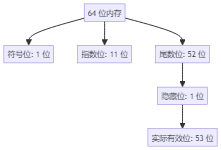

# JavaScript

## 类型、值、变量

### 数值
JavaScript的主要数值类型Number表示整数和近视实数。可以表示-2^53^ 到2^53-1^之间的整数（包含首尾值），如果超出则会出现精度损失。


#### 整数字面量
除了支持 十进制的数字，也支持十六进制。
```javascript
0
100
100000
console.log(0xff); // 255
```
ES6以后的版本中，也可以通过二进制或者八进制表示整数
```javascript 
console.log("二进制：", 0b10101);//21
console.log("八进制", 0o123);//83
```
#### 浮点字面量
- 基本用法，其中 3e2 表示为 3 * 10^2^，即值为 300
```javascript 
console.log(3.14);
console.log(.333333333);
console.log(3e2);//300
console.log(3e-2);//0.03
console.log(3.141111111E-32);//3.141111111e-32
```
- 数值字面量中的分隔符
	- 作为千分位的分隔符
	- 作为字节分隔符
	- 作为半字节分隔符
	- 小数部分
```javascript
console.log(1_000_000);
console.log(0x89_ab_cd_ef);
console.log(0o1234_567);
console.log(0.3_12121_111);
```
#### JavaScript中的算数
- JavaScript 程序使用语言提供的算术操作符来操作数值，包括 + 、 -、*、/、%，ES6增加了取幂的 ** 
- 通过Math对象的属性提供了一组函数和常量
```javascript

// 2 的 53 次方
console.log(Math.pow(2, 53));
// 舍入到最接近的整数
console.log(Math.round(.6)); // 1
console.log(Math.round(.4)); // 0
// 向上取整
console.log(Math.ceil(.6)); //1
// 向下取整
console.log(Math.floor(.6)); //0
// 绝对值
console.log(Math.abs(-1)); // 1
// 取最大值
console.log(Math.max(1, 2, 3, 4, 5)); // 5
// 取最小值
console.log(Math.min(1, 2, 3, 4, 5)); // 1
// 随机数 0 <= x < 1
console.log(Math.random());
// π 圆周率
console.log(Math.PI);
// 自然数对的底数
console.log(Math.E);
// 平方根
console.log(Math.sqrt(4));
// 立方根
console.log(Math.pow(8, 1 / 3));
// 三角函数
console.log(Math.sin(0));
console.log(Math.cos(0));
console.log(Math.tan(0));
console.log(Math.asin(0));
// 10 的自然数对
console.log(Math.log(10));
```
-  0/0 是没有意义的结果为 NaN（Not a Number）
- 上溢出，Infinity
- 下溢出，-Infinity
-  如果下溢出是负数，则会产生 -0
```javascript 
console.log(0 / 0); // NaN
console.log(1 / 0); // Infinity
console.log(Number.MAX_VALUE * 2); // Infinity
console.log(-Number.MAX_VALUE * 2); // -Infinity
console.log(-Number.MIN_VALUE / 2); // -0
```
- NaN，它与任何值比较都不相等，也不等于自己。
```javascript
console.log(Number.isNaN(NaN)); // true
console.log(Number.isNaN(1)); // false
```
- 全局isNaN，它会在参数是NaN时，或者在参数是无法转换为数值的非数值是返回 true
- Number.isFinite()，在参数不是NaN、Infinity、-Infinity时返回true
- 全局isFinite()，在参数是有限数或者可以转换为有限数时返回true
- 负零值，它与零值比较相等
#### 二进制浮点数与舍入错误
Javascript（以及所有现代编程语言）使用的IEEE-754浮点表示法是一种二进制表示法。所以无法精确表示某些十进制小数，以及舍入误差的累积
```javascript 
console.log(.3 - .2); // 0.09999999999999998
console.log(.2 - .1); // 0.1
```
- 计算机使用二进制来存储和处理数据，而大多数十进制的小数在二进制中无法精确表示。例如，0.1和0.2在二进制中的表示都是无限循环小数。计算机只能通过截断或舍入来近似表示这些值，这会导致误差。
- 在浮点数的运算中，舍入误差是无法避免的。当浮点数不能被精确表示时，计算机会自动舍入到最近的表示形式，这种舍入会随着多次运算逐步累积，导致最终结果的误差。
#### 通过BigInt表示任意精度整数

ES2020为JavaScript 定义了一种数值类型 BigInt

- BigInt数值类型的值是整数
- BigInt 字面量写作一串数字后跟小写字母n。默认情况下，基数是10，但可以通过前缀0b、0o和0x 来表示二进制、八进制和十六进制BigInt
```javascript
console.log(1234n); // 1234n
console.log(0b111111111111n); // 4095n
console.log(0o77777777777n); // 8589934591n
console.log(0xffffffffffffn); // 281474976710655n
```
- Math 对象的任何函数都不接受BigInt操作数

### 文本

